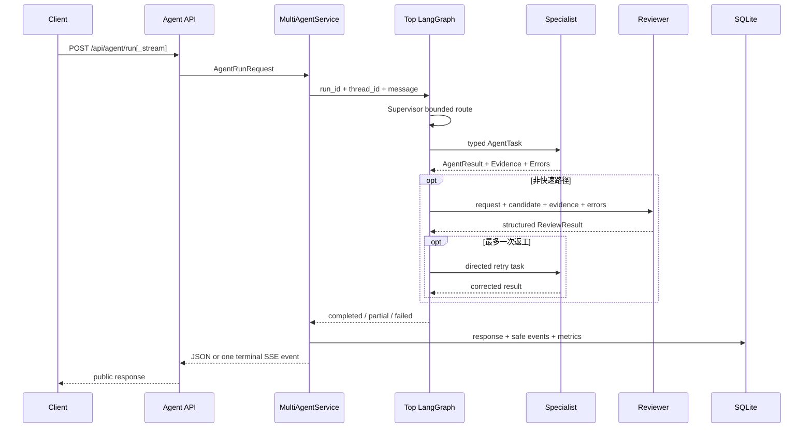

# 统一 Agent 请求执行时序（M5）

```mermaid
sequenceDiagram
    participant C as Client
    participant A as Agent API
    participant S as MultiAgentService
    participant G as Top LangGraph
    participant P as Specialist
    participant R as Reviewer
    participant DB as SQLite

    C->>A: POST /api/agent/run[_stream]
    A->>S: AgentRunRequest
    S->>G: run_id + thread_id + message
    G->>G: Supervisor bounded route
    G->>P: typed AgentTask
    P-->>G: AgentResult + Evidence + Errors
    opt 非快速路径
        G->>R: request + candidate + evidence + errors
        R-->>G: structured ReviewResult
        opt 最多一次返工
            G->>P: directed retry task
            P-->>G: corrected result
        end
    end
    G-->>S: completed / partial / failed
    S->>DB: response + safe events + metrics
    S-->>A: JSON or one terminal SSE event
    A-->>C: public response
```

客户端断开流式连接时，API 会关闭异步生成器；服务端异常被清洗后形成一个 `run_failed`
终态。正常流只产生一个 `run_completed` 或 `run_failed`。

